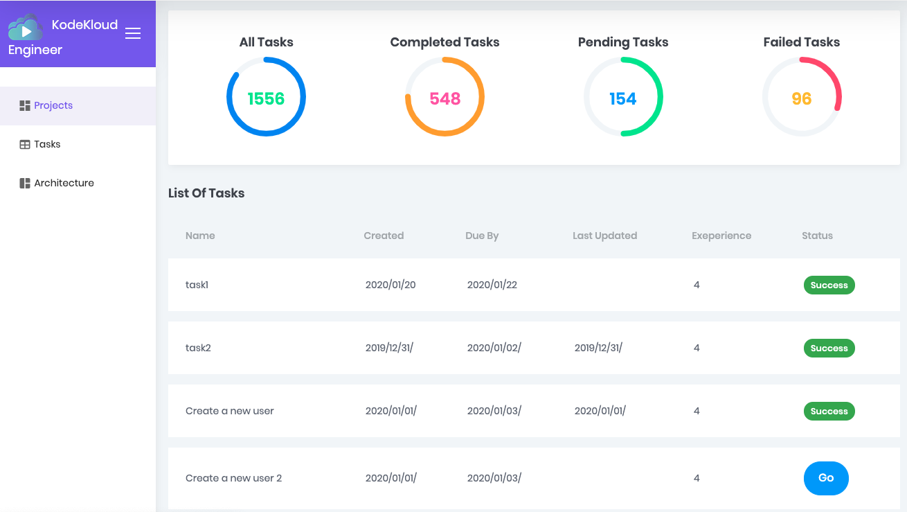

# Getting Started

KodeKloud Engineer is a FREE platform for IT Professionals to gain real hands-on experience working on trending IT 
technologies. To start logon to [engineer.kodekloud.com](engineer.kodekloud.com)

Currently we have a SysAdmin track that will help you gain experience in Linux System Administration. 
We will soon be adding a DevOps Track.

## Features

### Project Dashboard

The dashboard gives a view of the tasks assigned to you. Click on the Go button next to the pending task to 
perform the activity.
